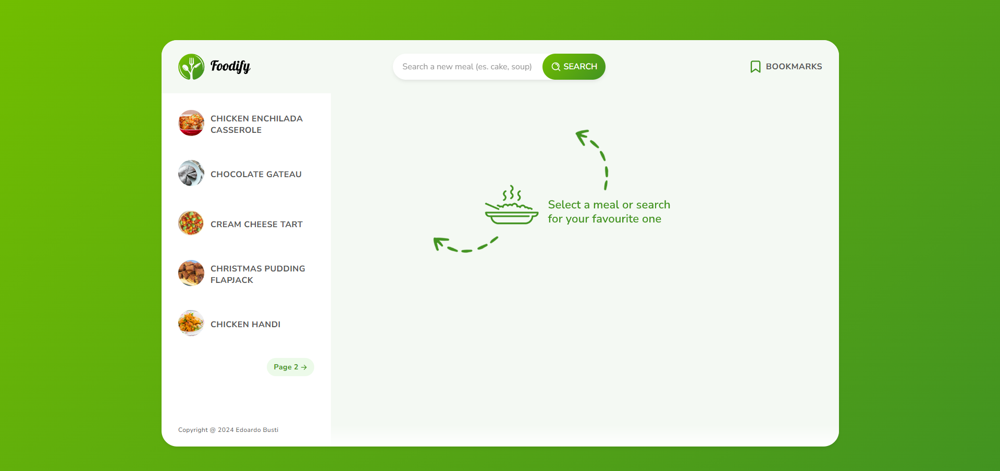
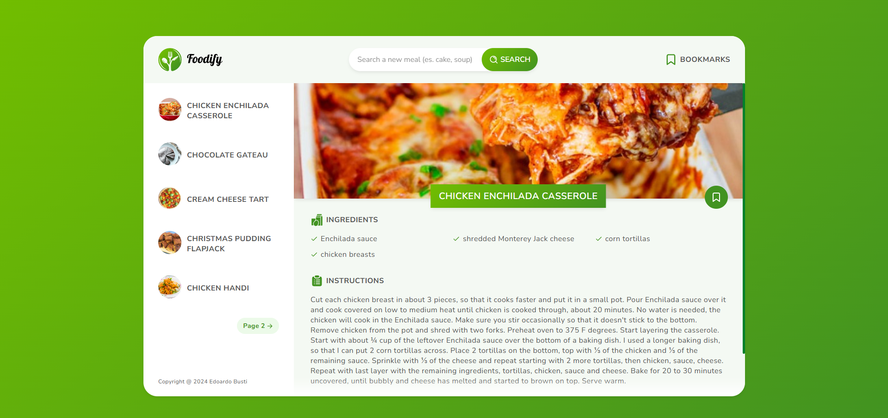
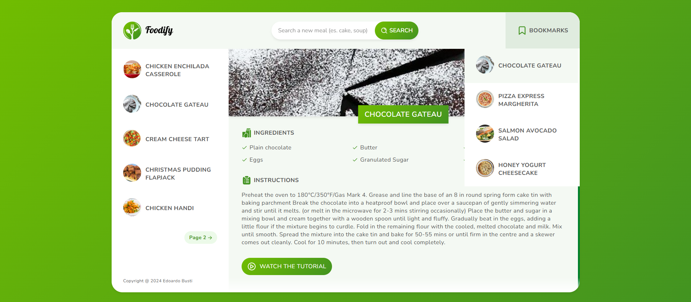

# 🍽️ Recipe Web Application

A web application that allows users to search for their favorite meals, view ingredients, save recipes, and follow step-by-step tutorials. Built following the MVC architecture pattern, ensuring a clean separation of concerns and easy maintenance. The app uses asynchronous functions for seamless data fetching and incorporates robust error handling to guarantee a smooth and reliable user experience.

**⚠️ Note**: This application is designed for desktop use only and is not mobile responsive.

## 🌟 Features

- **Search for Meals**: Users can search for their favorite recipes.
- **View Ingredients**: Each recipe displays the necessary ingredients.
- **Save Recipes**: Users can save their favorite recipes for easy access later.
- **Step-by-Step Tutorial**: View step-by-step instructions for preparing meals.
- **Asynchronous Data Fetching**: Smooth data retrieval with asynchronous functions for a better user experience.
- **Error Handling**: Robust error handling to manage issues like failed API requests or missing data.
- **Pixel-perfect design**: Every detail is crafted with precision to ensure a flawless user experience.

## 🏗️ Architecture

This application follows the **Model-View-Controller (MVC)** architecture pattern. It separates concerns into three main components:

- **Model**: Manages the application's data and business logic. It communicates with the API to fetch recipe data, handles data validation, and manages the application's state.
- **View**: Handles the user interface (UI) and presentation of data. It displays information to the user, such as recipes, ingredients, and instructions, and updates the UI based on user interactions.
- **Controller**: Manages the flow of data between the model and the view. It acts as an intermediary, processing user input, calling functions in the model, and updating the view accordingly.

## 🌍 API

The application uses **TheMealDB API** to fetch recipes from a database. This API provides data on a wide variety of recipes, including meal names, ingredients, and step-by-step instructions.

**📄 API Documentation**: You can explore TheMealDB API further [here](https://www.themealdb.com/api.php).

## 🚀 Technologies Used

- **HTML5**
- **CSS3**
- **JavaScript ES6+**
- **TheMealDB API**

## 🌐 Live Version on Netlify

You can view the live version of the project on **Netlify**:

- **🔗 Live Demo URL**: [https://foodify-vanilla.netlify.app](https://foodify-vanilla.netlify.app)

## 📸 Screenshots

### Landing Page

### Selected Meal

### Bookmarks View

